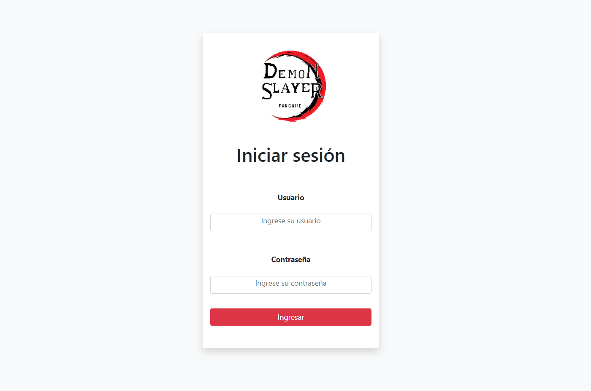

# Demon_Slayer_2023
Diseño y Desarrollo de Pagina Web, sobre Demon Slayer con HTML, CSS, JAVASCRIPT, Y BOOTSTRAP.

El proyecto "Demon_Slayer_2023" consiste en el diseño y desarrollo de una página web relacionada con la serie de anime "Demon Slayer". Se utiliza HTML, CSS, JavaScript y Bootstrap para crear una interfaz amigable y atractiva visualmente, donde se pueden encontrar diferentes secciones con información detallada sobre la serie, personajes, tramas y otros datos relevantes. El proyecto se aloja en la plataforma de GitHub, lo que permite compartir y colaborar en el código fuente con otros usuarios.

## URL:https://juancitopena.github.io/Demon_Slayer_2023/

## Fotos:

## Fotos:

## Fotos:

## Fotos:

